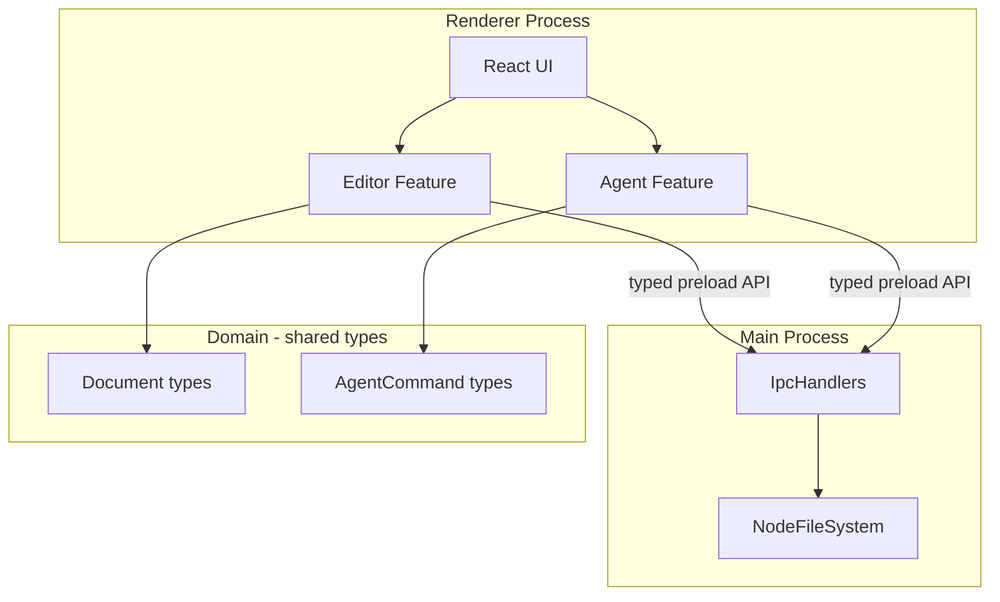

# LabWord Desktop Design

**Spec:** `.specs/features/labword-desktop/spec.md`  
**Status:** Approved

---

## Architecture Overview

Pragmatic **feature modules** with **ports** only at system boundaries (filesystem, IPC, AI). No repository/use-case layers unless a feature grows complex.



---

## Folder Layout

```
desktop/
  electron/
    main/           Main process bootstrap + window
    preload/        Typed bridge (contextBridge)
  src/
    app/            Composition root, service wiring
    domain/         Pure types + port interfaces
    features/       Editor, agent-terminal, preferences
    infrastructure/ Port implementations used in renderer via IPC
    shared/         Result, JsonValue, constants
  tests/            Vitest unit tests
```

---

## Type Safety Rules

| Rule | Enforcement |
|------|-------------|
| No `any` | ESLint error |
| No `object` / `Function` as types | `@typescript-eslint/ban-types` |
| No `unknown` | ESLint ban; use `JsonValue` + type guards at JSON parse |
| Explicit returns | `@typescript-eslint/explicit-function-return-type` |
| Explicit module boundaries | `domain` must not import `electron` or `react` |

### JsonValue (JSON boundary)

```typescript
export type JsonPrimitive = string | number | boolean | null;
export type JsonObject = { readonly [key: string]: JsonValue };
export type JsonArray = readonly JsonValue[];
export type JsonValue = JsonPrimitive | JsonObject | JsonArray;
```

---

## Components

### `domain/document/document.types.ts`

- **Purpose:** Core document model
- **Types:** `DocumentId`, `FilePath`, `DocumentContent`, `DocumentSnapshot`, `SaveDocumentRequest`, `SaveDocumentResult`

### `domain/agent/agent.types.ts`

- **Purpose:** Agent command and AI provider contracts
- **Types:** `AgentCommand`, `AgentCommandResult`, `AgentProviderPort`

### `infrastructure/filesystem/file-system.port.ts`

- **Purpose:** Abstract file I/O (Dependency Inversion)
- **Interface:** `FileSystemPort` — `readTextFile`, `writeTextFile`, `showOpenDialog`, `showSaveDialog`

### `electron/preload/labword-api.ts`

- **Purpose:** Typed renderer API exposed via `contextBridge`
- **Methods:** Mirror `IpcInvokeChannel` map — each channel typed args/result

### `features/editor/editor-feature.tsx`

- **Purpose:** CodeMirror wrapper + toolbar
- **Depends on:** `LabwordApi` from preload, `DocumentSnapshot`

### `features/agent-terminal/agent-terminal-feature.tsx`

- **Purpose:** Terminal UI with native `<input>` — Enter submits via `onKeyDown`
- **Depends on:** `AgentCommandService`, scrollback state

### `app/create-application-services.ts`

- **Purpose:** Single composition root (Simple DI)
- **Returns:** `ApplicationServices` record of wired services

---

## IPC Contract

| Channel | Args | Result |
|---------|------|--------|
| `document:open` | `{ path: FilePath }` | `DocumentSnapshot` |
| `document:save` | `SaveDocumentRequest` | `SaveDocumentResult` |
| `dialog:open-file` | `{ extensions: readonly string[] }` | `FilePath \| null` |

All channels defined once in `domain/ipc/ipc-channels.ts`; main handlers implement `IpcHandlerRegistry`.

---

## Code Reuse from Native

| Native concept | Desktop equivalent |
|----------------|-------------------|
| `DocumentSnapshot` | `domain/document/document.types.ts` |
| `AgentCommandRouter` | `features/agent-terminal/agent-command.service.ts` |
| `EditorCommandRegistry` | `domain/agent/command-registry.ts` |
| `HelpReference` | `shared/help/shortcuts.ts` |

Logic reimplemented in TS; no shared binary.

---

## SOLID Mapping

| Principle | Application |
|-----------|-------------|
| S | `AgentCommandService` only routes commands; `FileSystemPort` only I/O |
| O | New AI provider = new class implementing `AgentProviderPort` |
| L | Providers substitutable via port |
| I | Small ports: `FileSystemPort`, `AgentProviderPort` |
| D | Features depend on ports; main process implements FS |

Abstractions **only** at FS, IPC, and AI — not for every CRUD operation.

---

## Risks

| Risk | Mitigation |
|------|------------|
| Electron bundle size | Lazy-load AI providers; tree-shake |
| Duplicated business rules | Port command registry tests from native behavior |
| `unknown` temptation at IPC | Central `IpcContract` map; no ad-hoc invoke strings |
